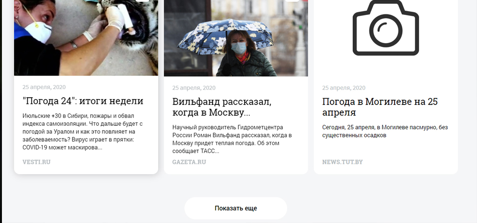
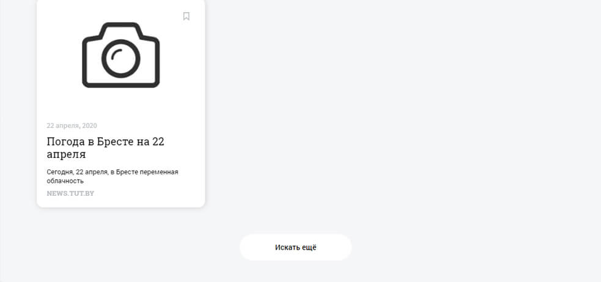
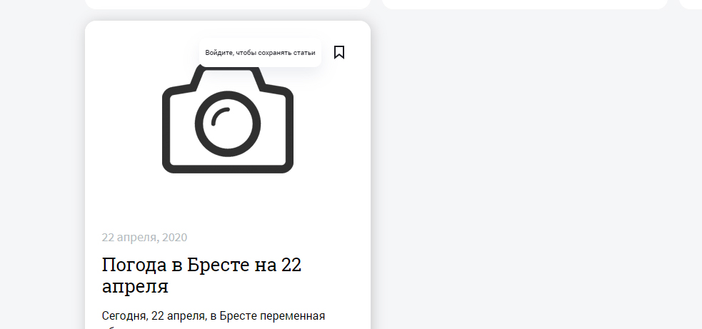
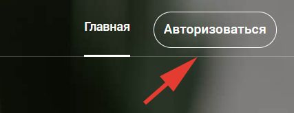
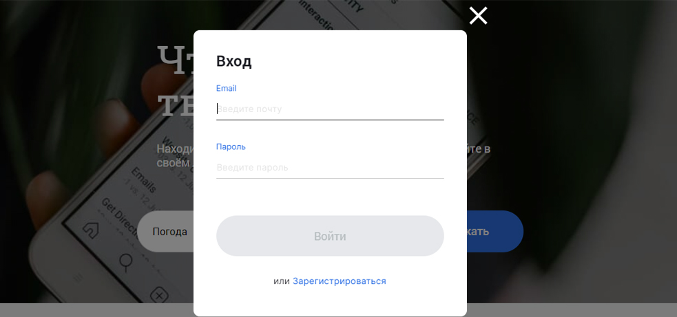
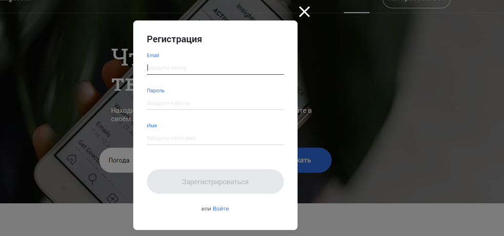
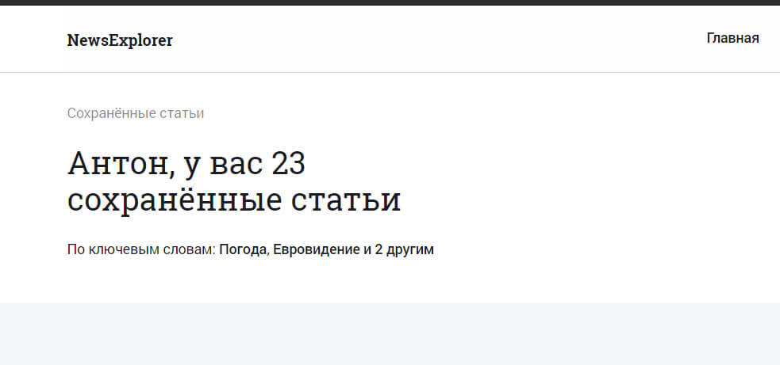
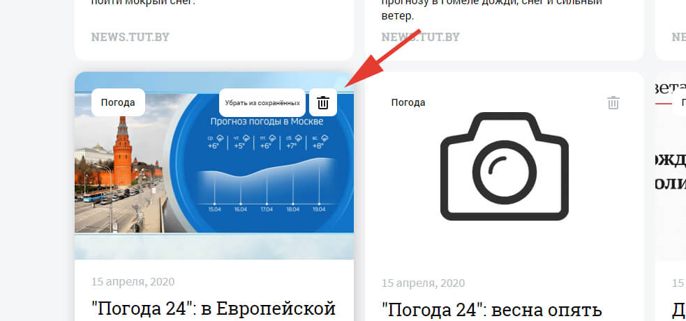

# Дипломный проект NewsExplorer

Version: v.0.1.0

## Описание Проекта

Проект представляет собой сервис, в котором можно найти новости по запросу и сохранить в личном кабинете.

Пользователь может искать статьи по ключевым словам, далее найденные статьи отображаются на сайте. Если пользователь зарегистрирован и выполнил вход, тогда он может добавить статью в избранное. В таком случае статья сохраниться на вкладке сохраненные статьи.
Так же зарегистрированный пользователь может удалить статью из своего списка избранных статьей нажав соответствующую кнопку.

[Подробное описание как пользоваться представлено ниже.](#Howtouse)

## Что умеет приложение
- Авторизация пользователя;
- Искать новости по ключевым словам;
- Добавлять новости в избранное;
- Определять коллличество сохраненных новостей, и популярность по тегам;
- Удалять новости из избранного.

## Что было сделано

- Верстка по макету `figma` с использованием `HTML`, `CSS`, `БЭМ`;
- Логика: `JavaScript`;
- Настроен вебпак:
    - html: `HtmlWebpackPlugin`;
    - обработка css: `css-loader`, `style-loader`, `postcss-loader`, `autoprefixer`, `cssnano`, `mini-css-extract-plugin`;
    - обработка изображений: `file-loader`, `image-webpack-loader`;
    - обработка шрифтов: `file-loader`;
    - сборка JS: `babel`;
- Кодстайлинг: `prettier`, `eslint`, `airbnb/base`;
- Новости подгружаются из [NewsApi](https://newsapi.org/);

## Ссылки на развернутое приложение
**Сейчас проект можно развернуть только локально инструкция ниже.**

на gh-pages работает только поиск новостей без возможности авторизации: 
https://tohaly.github.io/diploma-web-frontend/
### Локальный запуск проекта
1. Сначала нужно установить и локально развернуть API данного приложения [находится здесь](https://github.com/tohaly/diploma-web-backend);
2. Склонировать репозиторий
    ```
        git clone https://github.com/tohaly/diploma-web-frontend.git
    ```
2. Доставить отсутствющие модули npm
    ```
        npm i
    ```
3. Запустить локальный сервер
    ```
        npm run dev
    ```

### Публикация на GitHub Pages

1. Сделать форк проекта
2. Склонировать репозиторий
3. Доставить отсутствующие модули npm
   ```
       npm i
   ```
4. Собрать проект
   ```
       npm run build
   ```
5. Запушить собранный проект на GitHub
   ```
       npm run deploy
   ```
   
### Публикация на GitHub Pages
1. Сделать форк проекта
2. Склонировать репозиторий
    ```
        git clone https://github.com/tohaly/diploma-web-frontend.git
    ```
3. Доставить отсутствующие модули npm
    ```
        npm i
    ```
4. Собрать проект
    ```
        npm run build
    ```
5. Запушить собранный проект на GitHub
    ```
        npm run deploy
    ```

### Внесение изменений
1. При необходимости, после внесения изменений, запустить тестирование
    ```
        npm run eslint
    ```
2. Для автоматического исправления можно воспользоваться командой:
    ```
        npm run eslintFix
    ```


## <a name="Howtouse"></a> Как пользоваться

### Поиск новостей

Для начала нужной найти какую-нибудь новость. Для это в поле нужно ввести ключевое слово. NewsApi настроено таким образом, что поиск ведется и заголовке и в тексте самой новости.


Далее появиться список новостей. Новостные карточки появляются по три штуки. Что загрузить еще новостей нужно нажать на кнопку "показать еще".


После того как все найденные новостные карточки закончатся кнопка смениться название на "Искать еще". После нажатия на которую вы будете перемещены на верх, к полю поиска новостей.


### Авторизация

Для того что бы сохранять карточки нужно авторизоваться. Если вы не авторизированны при наведение на иконку сохранения на карточке она сообщит "Войдите, чтобы сохранять статьи".


Кнопка авторизоваться находиться в правом верхнем углу, после нажатия на которую появиться модальное окно.


Данное модальное окно предлагает выполнить вход, для зарегистрированных пользователей или зарегистрироваться для новых пользователей.


Окно регистрации


### Сохранение

Сохранить найденную новость можно нажав на иконку "Сохранить". Нажав на уже сохраненную новость можно удалить новость из сохраненных.


### Управление сохраненными новостями

На страницы "Сохраненные статьи", которая становиться доступна после авторизации. Хранятся все сохраненные новости, а так же статистика: число сохраненных статей, ключевые слова, по которым статьи были найдены.


Так же на данной страннице можно удалить статью из своего списка нажав на иконку "Корзины" в правом верхнем углу карточки статьи.

